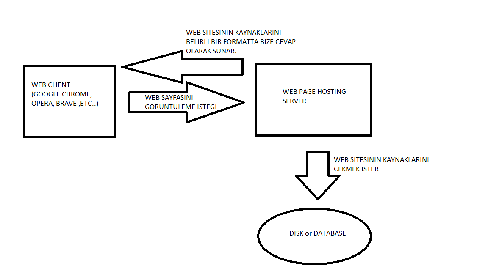
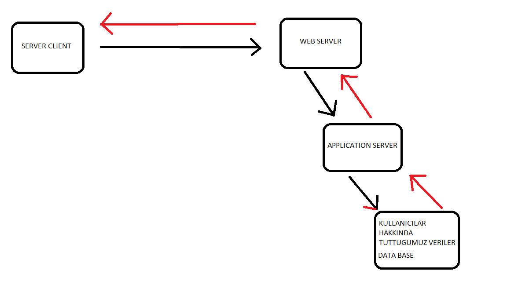

# 26/07/2022

## Statik Web Sitesi ve Dinamik Web Sitesi Nedir ?

---

Web siteleri temel olarak ikiye ayrilmaktadir.
Bunlar ;

- Statik Web Siteleri
- Dinamik Web Siteleri

### Statik Web Siteleri

---

Statik web siteleri ( tek sayfa web sitesi , sabit ,yerlesik web sitesi adlari ile de adlandirilmaktadir. )

Statik web siteleri kullanicinin web uygulamari tarafindan depoladigi web sitesi bilesenlerininin genellikle html ve css dokumanlarini bir server a FTP (file transfer protocol ) ile yuklenmesidir.

Statik web sitelerinde surekli olarak degisen ve guncellenen bir icerik ihtiyaci olmadiginda tercih edilir.

Genellikle veri tabani kullanmazlar .
Eger icerik guncellemesi gerekirse sunucuya FTP protokolu kullanan bir web araci ile baglanip gerekli guncellemeleri yapabilmekteyiz .

## FTP Protokolu :

Dosya Transfer Politikasidir. Internete bagli olan iki cihaz arasinda dosya transferini saglayan ve bu islemlere hizmet eden web uygulamasidir.
Ornek olarak web sitelerimizin icinde bulunmasi gereken .html ve .css uzantili dosyamizi ftp protokulu ile hosting hizmeti aldigimiz server ile iletisim kurmasi icin ftp protokulu kullanilan web uygulamalarini kullanabiliriz.

Karsi taraftaki server a kendi bilgisiyarimiz uzerinden veri gonderebilmek icin gerekli olan bilesenlerimizin olmasi gerekmektedir.Kullanici adi ve parola istenmektedir.Bazi yerlerde anonim FTP hizmeti de vermektedir.

FTP , dosya transferleri icin kullanilan sisteme giris , klasor degistirme , dosya adi degistirme islemleri icin genel olarak kullanilan port numarasi 21. port numarasidir.

FTP protokolu guvenlikli bir protok olarak dizayn edilmemistir. Kendimizin kullanci adi ve parola guvenligini saglamamiz gerekmektedir.

Kisacasi statik web siteleri

- dinamik web sitelerine gore daha hizlidir .
- Guvenlik riskleri bulunmaktadir.
- Daha kucuk basit projeler icin kullanilmaktadir.

---

kaynak_1 :https://en.wikipedia.org/wiki/Static_web_page#cite_note-Melendez,_SmallBussiness,_2018-1
kaynak_2: https://en.wikipedia.org/wiki/File_Transfer_Protocol
kaynak_3:https://www.milleni.com.tr/blog/teknoloji/ftp-nedir

  

### Dinamik Web Siteleri

---

Dinamik web sitelerinde statik web sitelerinin aksine su sekilde bir yol izlenmektedir .

Server Clientdan cikan sayfa goruntuleme istegi ----> Web server' a bu istek ulasir . Web Server goruntulemek istedigi web sayfasindaki bilgileri goremez cunku database ile iletisim kuracagi bir dil kullanmamaktadir . Kendi kullandigi dil bir markup dilidir.Bundan dolayi bir application server bulunur arada .

Bu application server database ile gerekli konusmalari saglamak icin yola cikar .

Database e ulastiktan sonra data base de gerekli sorgu islemi tamamlanip bir sonuc cikar bu sonucu application server isler ve web server a gerekli sayfayi ulastirir. Ulastirdigi bu sayfayi web server , web clientina iletir ve sayfa karsimiza cikar.

  
